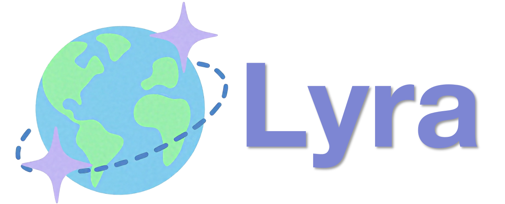

# Lyra : 3D-Aware Reinforcement Fine-Tuning for Interactive World Models


<div align="center">

  <div style="margin-top: 0; margin-bottom: -20px;">
    
  </div>

  <h3 style="margin-top: 0;">
    📄
    [<a href="https://arxiv.org/pdf/2512.08931" target="_blank">arXiv</a>]
    &nbsp;&nbsp;
    🏠
    [<a href="https://eternalevan.github.io/Lyra-project/" target="_blank">Project Page</a>]
    &nbsp;&nbsp;
    🤗
    [<a href="https://huggingface.co/EvanEternal/Lyra" target="_blank">Huggingface</a>]
  </h3>

</div>

<div align="center">

**[Yixuan Zhu](https://eternalevan.github.io/), [Wenjun Que](https://github.com/wjque), [Minglei Shi](https://shiml20.github.io), [Yanran Zhang](https://github.com/Zhangyr2022), [Chan Yan Ki](https://github.com/yankeee-0411), [Wenzhao Zheng<sup>†</sup>](https://wzzheng.net), [Jie Zhou](https://person.zju.edu.cn/en/lzz), [Jiwen Lu](https://person.zju.edu.cn/en/huhaoji)**
<!-- <br> -->
(† Project leader)

Tsinghua University
</div>

## 🔥 Updates
- __[2025.11.17]__: Release the [project page](https://eternalevan.github.io/Astra-project/).
- __[2025.12.09]__: Release the training and inference code, model checkpoint.

## 🎯 TODO List

- [ ] **Release full inference pipelines** for additional scenarios:
  - [ ] 🚗 Autonomous driving
  - [ ] 🤖 Robotic manipulation
  - [ ] 🛸 Drone navigation / exploration


- [ ] **Open-source training scripts**:
  - [ ] ⬆️ Action-conditioned autoregressive denoising training
  - [ ] 🔄 Multi-scenario joint training pipeline

- [ ] **Release dataset preprocessing tools**

- [ ] **Provide unified evaluation toolkit**
## 📖 Introduction

**TL;DR:** Astra is an **interactive world model** that delivers realistic long-horizon video rollouts under a wide range of scenarios and action inputs.

## Gallery

### Astra+Wan2.1

<table border="0" style="width: 100%; text-align: left; margin-top: 20px;">
  <tr>
      <td>
          <video src="https://github.com/user-attachments/assets/715a5b66-3966-4923-aa00-02315fb07761"
                 style="width:100%; height:180px; object-fit:cover;" 
                 controls autoplay loop muted></video>
      </td>
      <td>
          <video src="https://github.com/user-attachments/assets/1451947e-1851-4b57-a666-a44ffea7b10c"
                 style="width:100%; height:180px; object-fit:cover;" 
                 controls autoplay loop muted></video>
      </td>
      <td>
          <video src="https://github.com/user-attachments/assets/c7156c4d-d51d-493c-995e-5113c3d49abb"
                 style="width:100%; height:180px; object-fit:cover;" 
                 controls autoplay loop muted></video>
     </td>
      <td>
          <video src="https://github.com/user-attachments/assets/f7550916-e224-497a-b0b9-84479607c962"
                 style="width:100%; height:180px; object-fit:cover;" 
                 controls autoplay loop muted></video>
     </td>
  </tr>

  <tr>
      <td>
          <video src="https://github.com/user-attachments/assets/d899d704-c706-4e64-a24b-eea174d2173d"
                 style="width:100%; height:180px; object-fit:cover;" 
                 controls autoplay loop muted></video>
      </td>
      <td>
          <video src="https://github.com/user-attachments/assets/c1d8beb2-3102-468a-8019-624d89fba125"
                 style="width:100%; height:180px; object-fit:cover;" 
                 controls autoplay loop muted></video>
      </td>
      <td>
          <video src="https://github.com/user-attachments/assets/2aabc10b-f945-4d9d-b24a-baed17fcfe14"
                 style="width:100%; height:180px; object-fit:cover;" 
                 controls autoplay loop muted></video>
     </td>
      <td>
          <video src="https://github.com/user-attachments/assets/5c03e6ae-0fc2-4e09-a5b5-f37d04e7bbf8"
                 style="width:100%; height:180px; object-fit:cover;" 
                 controls autoplay loop muted></video>
     </td>
  </tr>
</table>

<!-- ## 🚀 Trail: Try ReCamMaster with Your Own Videos

**Update:** We are actively processing the videos uploaded by users. So far, we have sent the inference results to the email addresses of the first **1180** testers. You should receive an email titled "Inference Results of ReCamMaster" from either jianhongbai@zju.edu.cn or cpurgicn@gmail.com. Please also check your spam folder, and let us know if you haven't received the email after a long time. If you enjoyed the videos we created, please consider giving us a star 🌟.

**You can try out our ReCamMaster by uploading your own video to [this link](https://docs.google.com/forms/d/e/1FAIpQLSezOzGPbm8JMXQDq6EINiDf6iXn7rV4ozj6KcbQCSAzE8Vsnw/viewform?usp=dialog), which will generate a video with camera movements along a new trajectory.** We will send the mp4 file generated by ReCamMaster to your inbox as soon as possible. For camera movement trajectories, we offer 10 basic camera trajectories as follows:

| Index       | Basic Trajectory                  |
|-------------------|-----------------------------|
| 1    | Pan Right                   |
| 2 | Pan Left                    |
| 3 | Tilt Up                     |
| 4 | Tilt Down                   |
| 5 | Zoom In                     |
| 6 | Zoom Out                    |
| 7 | Translate Up (with rotation)   |
| 8 | Translate Down (with rotation) |
| 9 | Arc Left (with rotation)    |
| 10 | Arc Right (with rotation)   |

If you would like to use ReCamMaster as a baseline and need qualitative or quantitative comparisons, please feel free to drop an email to [jianhongbai@zju.edu.cn](mailto:jianhongbai@zju.edu.cn). We can assist you with batch inference of our model. -->

## ⚙️ Code: Astra + Wan2.1 (Inference & Training)
Astra is built upon [Wan2.1-1.3B](https://github.com/Wan-Video/Wan2.1), a diffusion-based video generation model. We provide inference scripts to help you quickly generate videos from images and action inputs. Follow the steps below:

### Inference
Step 1: Set up the environment

[DiffSynth-Studio](https://github.com/modelscope/DiffSynth-Studio) requires Rust and Cargo to compile extensions. You can install them using the following command:
```shell
curl --proto '=https' --tlsv1.2 -sSf [https://sh.rustup.rs](https://sh.rustup.rs/) | sh
. "$HOME/.cargo/env"
```

Install [DiffSynth-Studio](https://github.com/modelscope/DiffSynth-Studio):
```shell
git clone https://github.com/EternalEvan/Astra.git
cd Astra
pip install -e .
```

Step 2: Download the pretrained checkpoints
1. Download the pre-trained Wan2.1 models

```shell
cd script
python download_wan2.1.py
```
2. Download the pre-trained Astra checkpoint

Please download from [huggingface](https://huggingface.co/wjque/lyra/blob/main/diffusion_pytorch_model.ckpt) and place it in ```models/Astra/checkpoints```.

Step 3: Test the example image
```shell
python infer_demo.py \
  --dit_path ../models/Astra/checkpoints/diffusion_pytorch_model.ckpt \
  --wan_model_path ../models/Wan-AI/Wan2.1-T2V-1.3B \
  --condition_image ../examples/condition_images/garden_1.png \
  --direction forward_left \
  --prompt "A sunlit European street lined with historic buildings and vibrant greenery creates a warm, charming, and inviting atmosphere. The scene shows a picturesque open square paved with red bricks, surrounded by classic narrow townhouses featuring tall windows, gabled roofs, and dark-painted facades. On the right side, a lush arrangement of potted plants and blooming flowers adds rich color and texture to the foreground. A vintage-style streetlamp stands prominently near the center-right, contributing to the timeless character of the street. Mature trees frame the background, their leaves glowing in the warm afternoon sunlight. Bicycles are visible along the edges of the buildings, reinforcing the urban yet leisurely feel. The sky is bright blue with scattered clouds, and soft sun flares enter the frame from the left, enhancing the scene’s inviting, peaceful mood."  \
  --output_path ../examples/output_videos/output_moe_framepack_sliding.mp4 \

```

Step 4: Test your own images

To test with your own custom images, you need to prepare the target images and their corresponding text prompts. **We recommend that the size of the input images is close to 832×480 (width × height)**, which is consistent with the resolution of the generated video and can help achieve better video generation effects. For prompts generation, you can refer to the [Prompt Extension section](https://github.com/Wan-Video/Wan2.1?tab=readme-ov-file#2-using-prompt-extension) in Wan2.1 for guidance on crafting the captions.

```shell
python infer_demo.py \
  --dit_path path/to/your/dit_ckpt \
  --wan_model_path path/to/your/Wan2.1-T2V-1.3B \
  --condition_image path/to/your/image \
  --direction your_direction \
  --prompt your_prompt \
  --output_path path/to/your/output_video
```

We provide several preset camera types, as shown in the table below. Additionally, you can generate new trajectories for testing.

| direction         | Trajectory                  |
|-------------------|-----------------------------|
| `forward`         | Move Forward (Straight)     |
| `left`            | Rotate Left In Place        |
| `right`           | Rotate Right In Place       |
| `forward_left`    | Move Forward + Rotate Left  |
| `forward_right`   | Move Forward + Rotate Right |
| `s_curve`         | S-shaped Trajectory         |
| `left_right`      | Rotate Left → Rotate Right  |

### Training

Step 1: Set up the environment

```shell
pip install lightning pandas websockets
```

Step 2: Prepare the training dataset

1. Download the [MultiCamVideo dataset](https://huggingface.co/datasets/KwaiVGI/MultiCamVideo-Dataset).

2. Extract VAE features

```shell
CUDA_VISIBLE_DEVICES="0,1,2,3,4,5,6,7" python train_recammaster.py   --task data_process   --dataset_path path/to/the/MultiCamVideo/Dataset   --output_path ./models   --text_encoder_path "models/Wan-AI/Wan2.1-T2V-1.3B/models_t5_umt5-xxl-enc-bf16.pth"   --vae_path "models/Wan-AI/Wan2.1-T2V-1.3B/Wan2.1_VAE.pth"   --tiled   --num_frames 81   --height 480   --width 832 --dataloader_num_workers 2
```

3. Generate Captions for Each Video

You can use video caption tools like [LLaVA](https://github.com/haotian-liu/LLaVA) to generate captions for each video and store them in the ```metadata.csv``` file.

Step 3: Training
```shell
CUDA_VISIBLE_DEVICES="0,1,2,3,4,5,6,7" python train_recammaster.py   --task train  --dataset_path recam_train_data   --output_path ./models/train   --dit_path "models/Wan-AI/Wan2.1-T2V-1.3B/diffusion_pytorch_model.safetensors"   --steps_per_epoch 8000   --max_epochs 100   --learning_rate 1e-4   --accumulate_grad_batches 1   --use_gradient_checkpointing  --dataloader_num_workers 4
```
We do not explore the optimal set of hyper-parameters and train with a batch size of 1 on each GPU. You may achieve better model performance by adjusting hyper-parameters such as the learning rate and increasing the batch size.

Step 4: Test the model

```shell
python inference_recammaster.py --cam_type 1 --ckpt_path path/to/the/checkpoint
```

<!-- ## 📷 Dataset: MultiCamVideo Dataset
### 1. Dataset Introduction

**TL;DR:** The MultiCamVideo Dataset is a multi-camera synchronized video dataset rendered using Unreal Engine 5. It includes synchronized multi-camera videos and their corresponding camera trajectories. The MultiCamVideo Dataset can be valuable in fields such as camera-controlled video generation, synchronized video production, and 3D/4D reconstruction.

https://github.com/user-attachments/assets/6fa25bcf-1136-43be-8110-b527638874d4

The MultiCamVideo Dataset is a multi-camera synchronized video dataset rendered using Unreal Engine 5. It includes synchronized multi-camera videos and their corresponding camera trajectories.
It consists of 13.6K different dynamic scenes, each captured by 10 cameras, resulting in a total of 136K videos. Each dynamic scene is composed of four elements: {3D environment, character, animation, camera}. Specifically, we use animation to drive the character, 
and position the animated character within the 3D environment. Then, Time-synchronized cameras are set up to move along predefined trajectories to render the multi-camera video data.
<p align="center">
  
</p>

**3D Environment:** We collect 37 high-quality 3D environments assets from [Fab](https://www.fab.com). To minimize the domain gap between rendered data and real-world videos, we primarily select visually realistic 3D scenes, while choosing a few stylized or surreal 3D scenes as a supplement. To ensure data diversity, the selected scenes cover a variety of indoor and outdoor settings, such as city streets, shopping malls, cafes, office rooms, and the countryside.

**Character:** We collect 66 different human 3D models as characters from [Fab](https://www.fab.com) and [Mixamo](https://www.mixamo.com).

**Animation:** We collect 93 different animations from [Fab](https://www.fab.com) and [Mixamo](https://www.mixamo.com), including common actions such as waving, dancing, and cheering. We use these animations to drive the collected characters and create diverse datasets through various combinations.

**Camera:** To ensure camera movements are diverse and closely resemble real-world distributions, we create a wide range of camera trajectories and parameters to cover various situations. To achieve this by designing rules to batch-generate random camera starting positions and movement trajectories:

1. Camera Starting Position.

We take the character's position as the center of a hemisphere with a radius of {3m, 5m, 7m, 10m} based on the size of the 3D scene and randomly sample within this range as the camera's starting point, ensuring the closest distance to the character is greater than 0.5m and the pitch angle is within 45 degrees.

2. Camera Trajectories.

- **Pan & Tilt**:  
  The camera rotation angles are randomly selected within the range, with pan angles ranging from 5 to 45 degrees and tilt angles ranging from 5 to 30 degrees, with directions randomly chosen left/right or up/down.

- **Basic Translation**:  
  The camera translates along the positive and negative directions of the xyz axes, with movement distances randomly selected within the range of $[\frac{1}{4}, 1] \times \text{distance2character}$.

- **Basic Arc Trajectory**:  
  The camera moves along an arc, with rotation angles randomly selected within the range of 15 to 75 degrees.

- **Random Trajectories**:  
  1-3 points are sampled in space, and the camera moves from the initial position through these points as the movement trajectory, with the total movement distance randomly selected within the range of $[\frac{1}{4}, 1] \times \text{distance2character}$. The polyline is smoothed to make the movement more natural.

- **Static Camera**:  
  The camera does not translate or rotate during shooting, maintaining a fixed position.

3. Camera Movement Speed.

To further enhance the diversity of trajectories, 50% of the training data uses constant-speed camera trajectories, while the other 50% uses variable-speed trajectories generated by nonlinear functions. Consider a camera trajectory with a total of $f$ frames, starting at location $L_{start}$ and ending at position $L_{end}$. The location at the $i$-th frame is given by:
```math
L_i = L_{start} + (L_{end} - L_{start}) \cdot \left( \frac{1 - \exp(-a \cdot i/f)}{1 - \exp(-a)} \right),
```
where $a$ is an adjustable parameter to control the trajectory speed. When $a > 0$, the trajectory starts fast and then slows down; when $a < 0$, the trajectory starts slow and then speeds up. The larger the absolute value of $a$, the more drastic the change.

4. Camera Parameters.

We chose four set of camera parameters: {focal=18mm, aperture=10}, {focal=24mm, aperture=5}, {focal=35mm, aperture=2.4} and {focal=50mm, aperture=2.4}.

### 2. Statistics and Configurations

Dataset Statistics:

| Number of Dynamic Scenes | Camera per Scene | Total Videos |
|:------------------------:|:----------------:|:------------:|
| 13,600                   | 10               | 136,000      |

Video Configurations:

| Resolution  | Frame Number | FPS                      |
|:-----------:|:------------:|:------------------------:|
| 1280x1280   | 81           | 15                       |

Note: You can use 'center crop' to adjust the video's aspect ratio to fit your video generation model, such as 16:9, 9:16, 4:3, or 3:4.

Camera Configurations:

| Focal Length            | Aperture           | Sensor Height | Sensor Width |
|:-----------------------:|:------------------:|:-------------:|:------------:|
| 18mm, 24mm, 35mm, 50mm  | 10.0, 5.0, 2.4     | 23.76mm       | 23.76mm      |


### 3. File Structure
```
MultiCamVideo-Dataset
├── train
│   ├── f18_aperture10
│   │   ├── scene1    # one dynamic scene
│   │   │   ├── videos
│   │   │   │   ├── cam01.mp4    # synchronized 81-frame videos at 1280x1280 resolution
│   │   │   │   ├── cam02.mp4
│   │   │   │   ├── ...
│   │   │   │   └── cam10.mp4
│   │   │   └── cameras
│   │   │       └── camera_extrinsics.json    # 81-frame camera extrinsics of the 10 cameras 
│   │   ├── ...
│   │   └── scene3400
│   ├── f24_aperture5
│   │   ├── scene1
│   │   ├── ...
│   │   └── scene3400
│   ├── f35_aperture2.4
│   │   ├── scene1
│   │   ├── ...
│   │   └── scene3400
│   └── f50_aperture2.4
│       ├── scene1
│       ├── ...
│       └── scene3400
└── val
    └── 10basic_trajectories
        ├── videos
        │   ├── cam01.mp4    # example videos corresponding to the validation cameras
        │   ├── cam02.mp4
        │   ├── ...
        │   └── cam10.mp4
        └── cameras
            └── camera_extrinsics.json    # 10 different trajectories for validation
```

### 3. Useful scripts
- Data Extraction
```bash
cat MultiCamVideo-Dataset.part* > MultiCamVideo-Dataset.tar.gz
tar -xzvf MultiCamVideo-Dataset.tar.gz
```
- Camera Visualization
```python
python vis_cam.py
```

The visualization script is modified from [CameraCtrl](https://github.com/hehao13/CameraCtrl/blob/main/tools/visualize_trajectory.py), thanks for their inspiring work.

<p align="center">
  
</p> -->

## 🤗 Awesome Related Works
Feel free to explore these outstanding related works, including but not limited to:

[ReCamMaster](https://github.com/KlingTeam/ReCamMaster): ReCamMaster re-captures in-the-wild videos with novel camera trajectories. 

[GCD](https://gcd.cs.columbia.edu/): GCD synthesizes large-angle novel viewpoints of 4D dynamic scenes from a monocular video.

[ReCapture](https://generative-video-camera-controls.github.io/): a method for generating new videos with novel camera trajectories from a single user-provided video.

[Trajectory Attention](https://xizaoqu.github.io/trajattn/): Trajectory Attention facilitates various tasks like camera motion control on images and videos, and video editing.

[GS-DiT](https://wkbian.github.io/Projects/GS-DiT/): GS-DiT provides 4D video control for a single monocular video.

[Diffusion as Shader](https://igl-hkust.github.io/das/): a versatile video generation control model for various tasks.

[TrajectoryCrafter](https://trajectorycrafter.github.io/): TrajectoryCrafter achieves high-fidelity novel views generation from casually captured monocular video.

[GEN3C](https://research.nvidia.com/labs/toronto-ai/GEN3C/): a generative video model with precise Camera Control and temporal 3D Consistency.

## 🌟 Citation

Please leave us a star 🌟 and cite our paper if you find our work helpful.
```
@inproceedings{zhu2025astra,
  title={Astra: General Interactive World Model with Autoregressive Denoising},
  author={Zhu, Yixuan and Feng, Jiaqi and Zheng, Wenzhao and Gao, Yuan and Tao, Xin and Wan, Pengfei and Zhou, Jie and Lu, Jiwen},
  booktitle={arxiv},
  year={2025}
}
```
